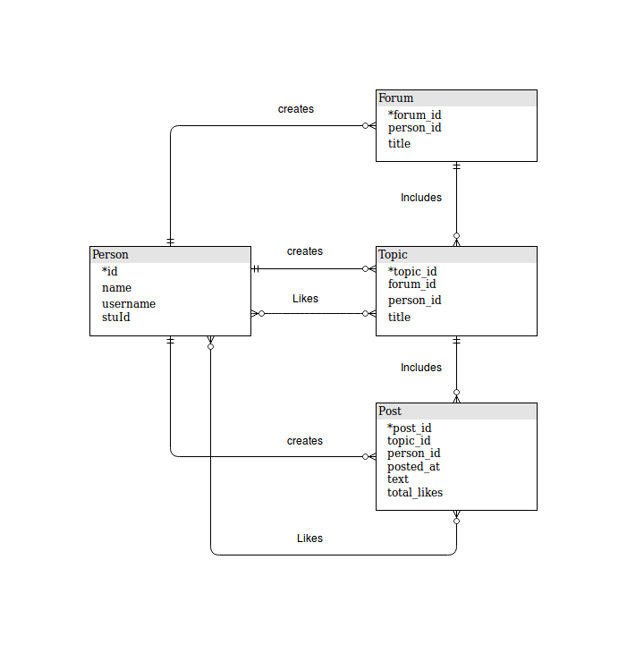

# Database design and API implementation for an online forum application
Design and implementation of server-/database-layer features of an online forum application.
- Database schema design based on forum requirements
- Query creation, optimization, and API implementation for security and performance

## Schema

### Normalization Process
To begin with, all requirements are collected, and a schema normalized up to BCNF is proposed. The level of de-normalization is determined during the implementation, after a clearer view is obtained. It’s easier to start with a highly normalized schema, and de- normalize later not below 2NF as needed for various tasks, than the opposite.

### De-normalization
total_likes was added to the Post table, to reduce the required number of queries for post related views, especially getTopic(). That introduces a transitive dependency {post_id} -> {total_likes}, as an aggregate attribute from another table is added to Posts, resulting in an update anomaly. Each time a post is liked, except the insertion at PostLikes table, the post’s total_likes has to be updated as well. But the performance/complexity(less joins, querys) benefits are likely to out weight the update anomaly.

Considering various anomaly tradeoffs, the final schema did not deviate much from the normalized one. Thus, the only difference was adding the total_likes column in the Post table, which simplified and speed things a lot in many related views, especially in regards to the getTopic(). This choice saved a lot in terms of query and joins quantity, because otherwise a count query would have to be executed in a loop.

## Queries
Typically, on a busy forum, poorly planned queries will result in a significant performance hit. This will become more apparent in production environments, where the database might be located in a remote server, and network latency becomes a factor. Consequently, the number of queries is reduced to the minimum possible in numerous occasions, and of cource queries in loops are almost always avoided.

## DB
- forum_schema.sql
- /home/evan/Desktop/projects/forum-db-api/bb/src/uk/ac/bris/cs/databases/cwk3

## Author

**Evan Lalopoulos** - [evanlal](https://github.com/evanlal)

## License
Written by Evan Lalopoulos <evan.lalopoulos.2017@my.bristol.ac.uk>  
University of Bristol, May 2018  
Copyright (C) 2018 - All rights reserved.  
Unauthorized copying is strictly prohibited.  
